# Phase 1 Development Plan: Foundation & Modernization

> **Branch:** `feature/new-ui`
> **Phase:** 1 of 5
> **Approach:** Sequential feature implementation
> **Detail Level:** High-level (feature breakdown with main tasks)

## Overview

Phase 1 establishes the foundation for the next generation of the C# Toolbox extension by:

1. Completing the new UI/UX work in progress on `feature/new-ui`
2. Adding modern .NET 9.0 and C# 13 support
3. Expanding the snippet library with modern C# patterns
4. Building a robust testing infrastructure
5. Improving overall code quality
6. Creating comprehensive documentation

This phase delivers immediate user value while preparing the codebase for future advanced features in Phases 2-5.

---

## Goals & Success Criteria

### Primary Goals

- Deliver a modern, polished project creation experience
- Bring the extension up-to-date with current .NET ecosystem
- Establish quality gates for future development
- Set up sustainable development practices

### Deliverables Checklist

- [ ] Enhanced UI/UX in `feature/new-ui` branch
- [ ] .NET 9.0 fully supported
- [ ] 30+ new modern C# snippets
- [ ] 80% test coverage
- [ ] All TypeScript strict mode compliant
- [ ] Comprehensive documentation
- [ ] Zero high-severity bugs

### Performance Targets

| Metric | Target |
|--------|--------|
| Extension activation time | < 500ms |
| Project creation | < 5 seconds |
| Webview render time | < 1 second |
| Snippet insertion latency | < 100ms |

---

## Prerequisites & Environment Setup

### Required Tools

- Node.js 20.x or higher
- npm 10.x or higher
- TypeScript 5.3.3+
- VS Code 1.85.0+
- .NET SDK 6.0, 7.0, 8.0, and 9.0 installed for testing
- Git

### Initial Setup Steps

1. Confirm working branch is `feature/new-ui`
2. Run `npm install` to ensure dependencies are current
3. Verify build succeeds: `npm run compile`
4. Verify lint passes: `npm run lint`
5. Verify .NET SDK detection: `dotnet --list-sdks`

---

## Implementation Plan (Sequential Order)

### Feature 1: Complete UI/UX Enhancements

> **Status:** In progress on `feature/new-ui`
> **Priority:** Critical (blocks other features)

#### Tasks

- [ ] Finalize project creation wizard redesign
- [ ] Add template preview cards with icons for each template
- [ ] Implement dark/light theme auto-detection using VS Code theme variables
- [ ] Add recent projects list (persisted in `globalState`)
- [ ] Create loading states and progress indicators
- [ ] Add form validation with real-time feedback
- [ ] Implement keyboard navigation (Tab, Enter, Esc)
- [ ] Add toast notifications for user feedback
- [ ] Polish animations and transitions
- [ ] Add tooltips with helpful descriptions

#### Files to Modify

- [`media/index.html`](../../media/index.html) - Wizard markup structure
- [`media/main.css`](../../media/main.css) - Theme variables, animations, responsive layout
- [`media/main.js`](../../media/main.js) - Wizard state management, validation, keyboard handling
- [`media/template-icons.js`](../../media/template-icons.js) - Icon definitions for all templates
- [`src/resource/createProjectWebView/CreateProject.ts`](../../src/resource/createProjectWebView/CreateProject.ts) - Webview lifecycle, message handling

#### Acceptance Criteria

- Wizard flows naturally from step to step
- All inputs validated before allowing progression
- Theme matches user's VS Code theme
- Recent projects accessible from initial wizard view
- All actions accessible via keyboard

---

### Feature 2: Add .NET 9.0 Support

> **Priority:** High (foundational for modern features)

#### Tasks

- [ ] Update `TEMPLATE_COMPATIBILITY` map to include `net9.0` for all applicable templates
- [ ] Add `net9.0` to `media/sdks.txt` (or update SDK detection logic)
- [ ] Update SDK detection in [`src/utils/sdk.provider.ts`](../../src/utils/sdk.provider.ts) to recognize .NET 9
- [ ] Add new project templates available in .NET 9
- [ ] Update framework selection UI to display .NET 9 prominently
- [ ] Test compatibility validation with .NET 9 SDK
- [ ] Update template defaults to suggest .NET 9 when available

#### Templates to Add

| Template | Short Name | Description |
|----------|------------|-------------|
| ASP.NET Core Web API (.NET 9) | `webapi` | Updated to support net9.0 |
| Blazor Web App (.NET 9) | `blazor` | Updated to support net9.0 |
| Console App (.NET 9) | `console` | Updated to support net9.0 |
| Worker Service | `worker` | Background service template |
| .NET Aspire App | `aspire` | Cloud-native orchestration |

#### Files to Modify

- [`src/utils/terminal-cmd.provider.ts`](../../src/utils/terminal-cmd.provider.ts) - Update `TEMPLATE_COMPATIBILITY`
- [`src/utils/sdk.provider.ts`](../../src/utils/sdk.provider.ts) - SDK detection logic
- [`src/utils/project-templates.ts`](../../src/utils/project-templates.ts) - Add new templates
- [`media/sdks.txt`](../../media/sdks.txt) - Add net9.0 to supported SDKs
- [`package.json`](../../package.json) - Bump version to 2.2.0

#### Acceptance Criteria

- .NET 9.0 appears in framework selection when SDK installed
- All existing templates work with .NET 9
- Compatibility validation correctly identifies .NET 9 templates
- New .NET 9-specific templates create successfully

---

### Feature 3: Modern C# Snippets (C# 11, 12, 13)

> **Priority:** High (immediate user value)

#### Tasks

- [ ] Add C# 13 snippets (collection expressions, primary constructors, params collections, lambda defaults)
- [ ] Add C# 12 snippets (primary constructors, inline arrays, type aliases)
- [ ] Add C# 11 snippets (required members, raw strings, list patterns, file-scoped types, UTF-8 strings, generic attributes)
- [ ] Add modern pattern snippets (Result, Option, Repository, CQRS, Minimal API)
- [ ] Update snippet documentation in README
- [ ] Test all snippets in actual C# files

#### Snippets to Add

##### C# 13 Features

| Prefix | Description |
|--------|-------------|
| `colexpr` | Collection expression `[1, 2, 3]` |
| `pctor` | Primary constructor for class |
| `paramcol` | Params collections |
| `lambdadef` | Lambda with default parameters |

##### C# 12 Features

| Prefix | Description |
|--------|-------------|
| `primaryctor` | Primary constructor for struct/class |
| `colinit` | Collection expression initializer |
| `inlinearr` | Inline array attribute |
| `typealias` | Using alias for any type |

##### C# 11 Features

| Prefix | Description |
|--------|-------------|
| `reqprop` | Required property |
| `reqfield` | Required field |
| `rawstr` | Raw string literal (multi-line) |
| `listpat` | List pattern matching |
| `filetype` | File-scoped type |
| `utf8str` | UTF-8 string literal |
| `genattr` | Generic attribute |
| `staticabs` | Static abstract member in interface |

##### Modern Patterns

| Prefix | Description |
|--------|-------------|
| `result` | Result/Either pattern implementation |
| `option` | Option/Maybe monad |
| `repository` | Generic repository pattern |
| `cqrshandler` | CQRS handler with MediatR |
| `minimalapi` | Minimal API endpoint |

#### Files to Modify

- [`snippets/general.json`](../../snippets/general.json) - Add C# language feature snippets
- [`snippets/designpattern.json`](../../snippets/designpattern.json) - Add modern pattern snippets
- [`README.md`](../../README.md) - Document new snippets

#### Acceptance Criteria

- All snippets expand correctly in C# files
- Snippets follow modern C# best practices
- Documentation is accurate and complete
- No conflicts with existing snippets

---

### Feature 4: Testing Infrastructure

> **Priority:** Medium (enables quality gates for remaining features)

#### Tasks

- [ ] Create test directory structure under `src/test/`
- [ ] Configure Mocha test runner
- [ ] Create VS Code API mocks
- [ ] Write unit tests for `CommandRegister`
- [ ] Write unit tests for `CommandFactory` and command classes
- [ ] Write unit tests for template validation logic
- [ ] Write unit tests for SDK provider
- [ ] Write unit tests for project templates utilities
- [ ] Write integration tests for project creation flow
- [ ] Set up code coverage reporting (nyc/c8)
- [ ] Create GitHub Actions workflow for CI
- [ ] Document how to run tests

#### Files to Create

- `src/test/runTest.ts` - Test runner entry point
- `src/test/suite/index.ts` - Test suite configuration
- `src/test/suite/commands.test.ts` - Command registration tests
- `src/test/suite/projectCreation.test.ts` - Project creation workflow tests
- `src/test/suite/snippets.test.ts` - Snippet validation tests
- `src/test/suite/sdkProvider.test.ts` - SDK detection tests
- `src/test/suite/templateCompatibility.test.ts` - Template validation tests
- `src/test/mocks/vscode.mock.ts` - VS Code API mocks
- `src/test/fixtures/` - Test data fixtures
- `.github/workflows/test.yml` - CI workflow

#### Acceptance Criteria

- All tests pass on Windows, macOS, Linux
- Code coverage reaches 80%+ for source files
- Tests run in under 30 seconds
- CI workflow blocks PRs with failing tests

---

### Feature 5: Code Quality Improvements

> **Priority:** Medium (technical debt reduction)

#### Tasks

- [ ] Add TSDoc comments to all public APIs
- [ ] Replace `any` types with proper types throughout codebase
- [ ] Extract magic strings to a constants file
- [ ] Implement proper error handling with try-catch boundaries
- [ ] Add structured logging utility
- [ ] Enable stricter TypeScript settings (`noImplicitAny`, `strictFunctionTypes`)
- [ ] Run lint and fix all warnings
- [ ] Refactor large functions into smaller, focused units

#### Files Requiring Refactoring

- [`src/CommandRegister.ts`](../../src/CommandRegister.ts) - Type the callback parameters properly
- [`src/resource/contextualMenu/ContextualMenu.ts`](../../src/resource/contextualMenu/ContextualMenu.ts) - Replace `any`, extract helpers
- [`src/resource/smartComments/SmartComments.ts`](../../src/resource/smartComments/SmartComments.ts) - Use proper types
- [`src/resource/createProjectWebView/CreateProject.ts`](../../src/resource/createProjectWebView/CreateProject.ts) - Remove `any`, type messages
- [`src/utils/terminal-cmd.provider.ts`](../../src/utils/terminal-cmd.provider.ts) - Already partially refactored
- [`src/utils/sdk.provider.ts`](../../src/utils/sdk.provider.ts) - Add proper return types

#### New Files

- `src/constants.ts` - Extension-wide constants
- `src/utils/logger.ts` - Structured logging utility
- `src/types/messages.ts` - Webview message type definitions

#### Acceptance Criteria

- Zero `any` types in source code (or explicitly justified with comments)
- All public methods have TSDoc comments
- Lint passes with zero warnings
- All tests still pass after refactoring

---

### Feature 6: Documentation

> **Priority:** Medium (captures all changes)

#### Tasks

- [ ] Update README.md with new features and snippets
- [ ] Create CONTRIBUTING.md with contributor guidelines
- [ ] Add JSDoc/TSDoc throughout codebase (covered in Feature 5)
- [ ] Create feature documentation in `docs/`
- [ ] Add examples and screenshots for new UI
- [ ] Document new snippets with usage examples
- [ ] Update CHANGELOG.md with version 2.2.0 changes
- [ ] Create release notes template

#### Files to Create/Update

- [`README.md`](../../README.md) - Add new features section, .NET 9 mention, modern snippets
- [`CHANGELOG.md`](../../CHANGELOG.md) - Add 2.2.0 entry
- [`ROADMAP.md`](../../ROADMAP.md) - Already created
- `CONTRIBUTING.md` - Contribution guidelines, dev setup, PR process
- `docs/FEATURES.md` - Detailed feature documentation
- `docs/SNIPPETS.md` - Complete snippet reference
- `docs/TEMPLATES.md` - Project template guide
- `docs/DEVELOPMENT.md` - Developer setup and architecture

#### Acceptance Criteria

- README accurately reflects current capabilities
- New contributors can set up dev environment from CONTRIBUTING.md
- All snippets documented with examples
- Architecture diagram included in DEVELOPMENT.md

---

## Quality Gates

Each feature must meet these criteria before moving to the next:

| Gate | Requirement |
|------|-------------|
| Compilation | `npm run compile` succeeds with zero errors |
| Linting | `npm run lint` passes with zero errors/warnings |
| Tests | All existing tests pass (when test infra exists) |
| Manual Testing | Feature manually verified by developer |
| Code Review | Changes reviewed (self-review at minimum) |
| Documentation | Relevant documentation updated |

---

## Testing Strategy

### Unit Tests

- Command registration and execution
- Template validation logic
- Framework compatibility checks
- Snippet parsing and insertion
- SDK detection logic
- Template provider functions

### Integration Tests

- Project creation end-to-end
- Solution file generation
- File system operations
- VS Code API interactions
- Webview message passing

### Manual Testing Checklist

- [ ] Create project for each template type
- [ ] Test all keyboard shortcuts
- [ ] Verify context menu commands (Class, Interface, Struct, Record)
- [ ] Test snippet expansion for all new snippets
- [ ] Validate .NET 9 project creation
- [ ] Test on Windows
- [ ] Test on macOS
- [ ] Test on Linux
- [ ] Test with multiple .NET SDKs installed
- [ ] Test default folder configuration
- [ ] Test smart comments highlighting
- [ ] Test add project to existing solution

---

## Implementation Workflow Diagram

```mermaid
flowchart LR
    Start[Phase 1 Start] --> F1[Feature 1: UI/UX]
    F1 --> F2[Feature 2: .NET 9]
    F2 --> F3[Feature 3: Snippets]
    F3 --> F4[Feature 4: Testing]
    F4 --> F5[Feature 5: Code Quality]
    F5 --> F6[Feature 6: Documentation]
    F6 --> Release[Release v2.2.0]
    Release --> Phase2[Begin Phase 2]
```

---

## Risk Assessment

| Risk | Likelihood | Impact | Mitigation |
|------|------------|--------|------------|
| .NET 9 templates change between previews | Medium | Medium | Validate against latest stable SDK |
| Test infra setup blocks other features | Low | High | Set up testing in parallel with Feature 5 |
| UI changes break existing workflows | Medium | High | Comprehensive manual testing |
| Performance regression from new features | Low | Medium | Add performance benchmarks |
| Breaking changes for existing users | Low | High | Maintain backward compatibility |

---

## Versioning

- **Current Version:** 2.1.1
- **Target Version (Phase 1 Complete):** 2.2.0
- **Versioning Strategy:** Semantic Versioning (semver)
    - MAJOR: Breaking changes
    - MINOR: New features (Phase 1 release)
    - PATCH: Bug fixes

---

## Next Steps After Phase 1

Upon completion of Phase 1, evaluate progress and plan Phase 2:

1. Conduct retrospective on Phase 1 delivery
2. Gather user feedback from v2.2.0 release
3. Refine Phase 2 scope based on learnings
4. Begin Phase 2: Advanced Features
    - AI-powered code generation
    - Advanced scaffolding templates (Clean Architecture, DDD)
    - IntelliSense enhancements
    - NuGet package management UI

---

## Current Branch Status

Working from `feature/new-ui` branch which already includes:

- Enhanced wizard interface
- Multi-step project creation
- Framework selection improvements
- Template validation
- Better error handling

**Recent commits show good progress on:**

- Template compatibility validation
- Command refactoring with strategy/factory patterns
- UI improvements with new wizard
- Option flags (`noHttps`, `useControllers`, `noTopLevelStatements`)
- Improved logging in command execution

---

## References

- [ROADMAP.md](../../ROADMAP.md) - Full roadmap across all 5 phases
- [README.md](../../README.md) - Extension overview
- [CHANGELOG.md](../../CHANGELOG.md) - Version history
- [.NET 9 Release Notes](https://learn.microsoft.com/en-us/dotnet/core/whats-new/dotnet-9/overview)
- [C# 13 Language Features](https://learn.microsoft.com/en-us/dotnet/csharp/whats-new/csharp-13)
- [VS Code Extension API](https://code.visualstudio.com/api)

---

**Status:** Active - This plan is the source of truth for Phase 1 implementation work.
