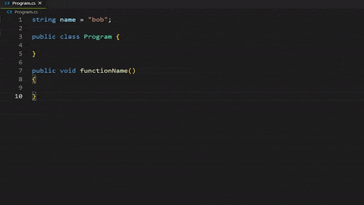
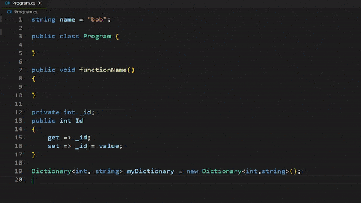
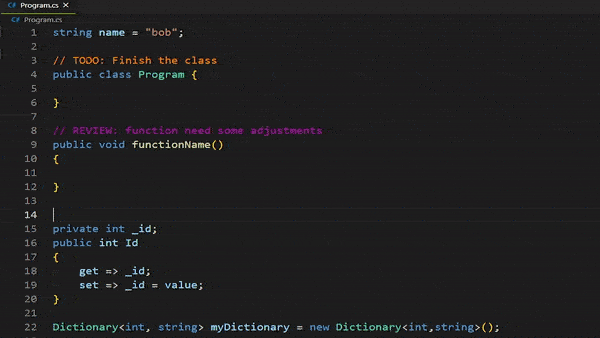

<h2 align="center">
C# Snippet Productivity
</h2>
<h3 align="center">
	
    	
    
    	
	 
</h3>

## Goal

> - C# Snippet Productivity aims to increase the use of vscode editor as the main tool for console, web and game development in C# Programming Language providing the same shortcuts, efficiency, intellisense that is offered by Visual Studio Community.
> - One of the first objectives is to reduce the amount of extensions downloaded for C# reducing the time and effort on configuration that has to be done by the user as well as to avoid extensions conflicts. Also offers really handy snippets to speed up your development workflow.

## What's new in 1.0.0

> - Initial project release
> - Custom comments: colorful comments for better coding organization
>   - NORMAL comments [***//***]
>   - TODO: comments [***todo***]
>   - REVIEW: comments [***review***]
>   - BUG: comments [***bug***]
>   - RESEARCH: comments [***research***]
> - General C# snippets
> - XML Documentation snippets

## Current features

> ### General Snippets
>
> - **_todo_** : comments
> - **_review_** : comments
> - **_bug_** : comments
> - **_research_** : comments
> - **_cw_** : console write/writeline
> - **_cwi_** : console writeline interpolation
> - **_cr_** : console readline
> - **_crk_**: console readkey
> - **_clr_**: console clear
> - **_var_**: variable declaration
> - **_if_**: if statement
> - **_else_**: else statement
> - **_ifelse_**: if/else statement
> - **_iif_**: conditional operator
> - **_enum_**: enum type
> - **_switch_**: switch statement
> - **_using_**: using statement
> - **_while_**: while loop
> - **_dowhile_**: do/while loop
> - **_for_**: for loop
> - **_foreach_**: foreach loop
> - **_arr_**: array structure
> - **_lst_**: list structure
> - **_ilst_**: Ilist structure
> - **_dic_**: dictionary structure
> - **_cdic_**: concurrent dictionary structure
> - **_idic_**: idictionary structure
> - **_func_**: create a void function
> - **_vfunc_**: create a virtual function
> - **_afunc_**: create an abstract function
> - **_rfunc_**: create a function with return type
> - **_sfunc_**: create a static function
> - **_pfunc_**: create a function using params
> - **_try_**: create a try/catch block
> - **_namespace_**: add namespace
> - **_struct_**: create a struct
> - **_class_**: create a class based on the file name
> - **_ctor_**: class constructor
> - **_instantiate_**: object instantiation
> - **_fclass_**: class created with a default constructor and three overrides [ToString, Equals, GetHashCode]
> - **_sclass_**: create a static class
> - **_aclass_**: create an abstract class
> - **_interface_**: create an interface based on the file name
> - **_prop_**: create a property
> - **_prope_**: create an expanded property
> - **_record_**: create a record
>
> ### XML Documentation Snippets
>
> - **_xml-summary_**: this tag adds brief information about a type or member
> - **_xml-remarks_**: the [remarks] tag supplements the information about types or members that the [summary] tag provides
> - **_xml-returns_**: the [returns] tag describes the return value of a method declaration
> - **_xml-value_**: the [value] tag is similar to the [returns] tag, except that you use it for properties
> - **_xml-example_**: You use the [example] tag to include an example in your XML documentation. This involves using the child [code] tag
> - **_xml-para_**: you use the [para] tag to format the content within its parent tag. [para] is usually used inside a tag, such as [remarks] or [returns], to divide text into paragraphs. You can format the contents of the [remarks] tag for your class definition
> - **_xml-c_**: still on the topic of formatting, you use the [c] tag for marking part of text as code. It's like the [code] tag but inline. It's useful when you want to show a quick code example as part of a tag's content
> - **_xml-exception_**: by using the [exception] tag, you let your developers know that a method can throw specific exceptions
> - **_xml-see_**: the [see] tag lets you create a clickable link to a documentation page for another code element
> - **_xml-seealso_**: you use the [seealso] tag in the same way you do the [see] tag. The only difference is that its content is typically placed in a \"See Also\" section
> - **_xml-param_**: you use the [param] tag to describe a method's parameters
> - **_xml-typeparam_**: You use [typeparam] tag just like the [param] tag but for generic type or method declarations to describe a generic parameter
> - **_xml-paramref_**: sometimes you might be in the middle of describing what a method does in what could be a [summary] tag, and you might want to make a reference to a parameter
> - **_xml-typeparamref_**: you use [typeparamref] tag just like the [paramref] tag but for generic type or method declarations to describe a generic parameter
> - **_xml-list_**: you use the [list] tag to format documentation information as an ordered list, unordered list, or table
> - **_xml-inheritdoc_**: you can use the [inheritdoc] tag to inherit XML comments from base classes, interfaces, and similar methods
> - **_xml-include_**: the [include] tag lets you refer to comments in a separate XML file that describe the types and members in your source code, as opposed to placing documentation comments directly in your source code file

## How to use

> - All the snippets comments are shown as -> snippet name
> - Snippets were created thinking on productivity and the extensive use of tab key

> - Colored comments were created to increase visibility of todo's, reviews, bugs and research

## Do you want to contribute?

### Guidelines

> 1. **Fork** the original repository to your own repository
> 2. **Clone** it to your local
> 3. **Contribute to it**
> 4. **Push** it to your remote repo
> 5. Send a **PR** `[Pull Request]` to the main repo
> 6. Your contribution will be evaluated then we will merge your changes with the original repository. ❤

### For more information

- [Richard Zampieri](https://github.com/rsaz)

**Enjoy!**
